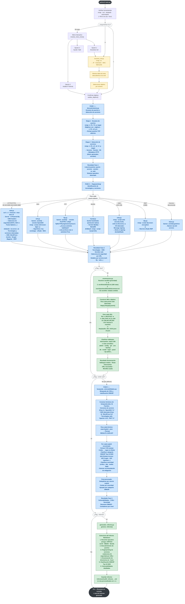

# Flujo Metodológico con Mermaid — AuditX

```mermaid
flowchart TD
    %% ─────────────────────────────────────
    %% ARRANQUE
    %% ─────────────────────────────────────
    START(["python3 main.py"])
    START --> TOOLS["Verificar herramientas\nnmap · curl · whatweb · searchsploit\n(+ ffuf si se usa --fuzz)"]

    TOOLS --> ARGS{{"¿Argumentos CLI?"}}

    %% ─────────────────────────────────────
    %% MODO 1 — SIN ARGUMENTOS → MENÚ
    %% ─────────────────────────────────────
    ARGS -- "Sin args" --> MENU["Menú Interactivo\nmostrar_menu_inicio()"]

    MENU --> M1["Opción 1\nEscanear red"]
    MENU --> M2["Opción 2\nAuditar IP directa"]
    MENU --> M3["Opción 3\nAyuda / Salir"]

    M1 --> NET
    M2 --> CONFIRM

    %% ─────────────────────────────────────
    %% MODO 2 — ESCANEO DE RED (-n)
    %% ─────────────────────────────────────
    ARGS -- "-n <CIDR>" --> NET["escaneo_red.py\nnmap -sn <red/CIDR>\n→ IP · hostname · MAC · fabricante"]
    NET --> NETTABLE["Mostrar tabla de hosts\ndescubiertos en la red"]
    NETTABLE --> NETSEL["Seleccionar objetivo\npor número"]
    NETSEL --> CONFIRM

    %% ─────────────────────────────────────
    %% MODO 3 — AUDITORÍA DIRECTA (-t)
    %% ─────────────────────────────────────
    ARGS -- "-t <IP/host>" --> CONFIRM["Confirmar objetivo\nauditar_objetivo()"]

    %% ─────────────────────────────────────
    %% FASE 1 — DESCUBRIMIENTO
    %% ─────────────────────────────────────
    CONFIRM --> F1_TITLE["FASE 1 — descubrimiento.py\nEscaneo de puertos y detección de servicios"]

    F1_TITLE --> F1A["Etapa 1 · Escaneo de puertos\nnmap -n -Pn -T4 -p- target\n(Sigiloso con --sigiloso: -n -Pn -sS -p-)\n→ Extraer puertos TCP abiertos"]

    F1A --> F1B["Etapa 2 · Detección de servicios\nnmap -n -Pn -sV -sC -O -p <puertos> target\n→ Servicio · Versión · OS\n→ Metadatos HTTP (título, generador, servidor)"]

    F1B --> F1OUT["Resultado Fase 1\nLista de puertos: puerto · servicio · versión · es_web\nSistema operativo detectado"]

    %% ─────────────────────────────────────
    %% FASE 2 — FINGERPRINTING
    %% ─────────────────────────────────────
    F1OUT --> F2_TITLE["FASE 2 — fingerprinting/\nIdentificación de tecnologías y versiones"]

    F2_TITLE --> F2_LOOP{{"Para cada\npuerto abierto"}}

    F2_LOOP -- "HTTP/HTTPS\n80·443·8080·8443·8000·8888" --> WEB["web.py\ncurl -s -I --insecure --max-time 10 <url>\n→ Server · X-Powered-By · CMS headers\n→ Cabeceras de seguridad (HSTS, CSP, X-Frame-Options...)\n\nwhatweb --no-errors -a1 <url>\n→ Tecnologías y versiones detectadas\n→ CMS: WordPress · Joomla · Drupal · Magento · SPIP"]

    F2_LOOP -- "SSH" --> SSH["ssh.py\nbanner_socket() → versión OpenSSH\nnmap --script ssh2-enum-algos -p <puerto>\n→ Algoritmos: key exchange · cifrado · MAC"]

    F2_LOOP -- "FTP" --> FTP["ftp.py\nbanner_socket() → versión ProFTPD / vsftpd\nftplib.FTP().login('anonymous')\n→ ¿Acceso anónimo habilitado?\n→ Lista archivos raíz si anónimo=True"]

    F2_LOOP -- "MySQL" --> MYSQL["mysql.py\nSocket handshake (protocolo nativo)\n→ Versión MySQL / MariaDB\n(Fallback: nmap --script mysql-info)"]

    F2_LOOP -- "SMB\n(445·139)" --> SMB["smb.py\nnmap --script smb-security-mode,\nsmb-os-discovery -p <puerto>\n→ OS detectado · Message signing\n→ Alerta si signing deshabilitado"]

    F2_LOOP -- "RDP\n(3389)" --> RDP["rdp.py\nnmap --script rdp-enum-encryption\n-p <puerto>\n→ Nivel de cifrado RDP"]

    F2_LOOP -- "Servicio\ndesconocido" --> GEN["base.py\nbanner_socket() genérico\n→ Banner raw del servicio"]

    WEB & SSH & FTP & MYSQL & SMB & RDP & GEN --> F2OUT["Resultado Fase 2\nTecnologías · CMS · Servidor web\nCabeceras de seguridad por URL\nDetalles por servicio (ssh · ftp · smb...)"]

    %% ─────────────────────────────────────
    %% MÓDULO OPCIONAL — ENUMERACIÓN (--fuzz)
    %% ─────────────────────────────────────
    F2OUT --> FUZZ_Q{{"¿Flag --fuzz?"}}

    FUZZ_Q -- "No" --> VULN_Q

    FUZZ_Q -- "Sí" --> FUZZ_WL["enumeracion.py\nResolver wordlist (prioridad):\n1. -w <ruta_personalizada>\n2. wordlists/default.txt (168 rutas)\n3. /usr/share/wordlists/dirb/common.txt\n→ Sin wordlist: módulo omitido"]

    FUZZ_WL --> FUZZ_URL["Construir URLs objetivo\nPara cada puerto web detectado:\nhttp(s)://target[:puerto]"]

    FUZZ_URL --> FUZZ_RUN["Para cada URL:\nffuf -u URL/FUZZ -w <wordlist>\n-e .php,.html,.txt,.js,.bak\n-mc 200,301,302,403\n-t 50 -timeout 5\n-maxtime <timeout_fuzz (def. 600s)>\n-o /tmp/auditx_ffuf_XXXX.json -of json"]

    FUZZ_RUN --> FUZZ_CLASS["Clasificar hallazgos\nInteresantes: status 200\no rutas sensibles:\nadmin · config · .git · .env · backup\ndb · install · login · panel · wp-admin..."]

    FUZZ_CLASS --> FUZZ_OUT["Resultado Enumeración\nHallazgos totales · Rutas interesantes\nURLs fuzzeadas · Wordlist usada"]

    FUZZ_OUT --> VULN_Q

    %% ─────────────────────────────────────
    %% FASE 3 — BÚSQUEDA DE VULNERABILIDADES
    %% ─────────────────────────────────────
    VULN_Q{{"¿Flag --omitir-vuln?"}} -- "Sí" --> RPT_Q

    VULN_Q -- "No (por defecto)" --> F3_TITLE["FASE 3 — busqueda_vulnerabilidades.py\nBúsqueda de CVEs y clasificación OWASP"]

    F3_TITLE --> F3_TERMS["Construir términos de búsqueda (máx. 8)\nFuentes:\n· Versiones de servicio (Fase 1): 'OpenSSH 7.4'\n· CMS detectado (Fase 2): 'WordPress 5.8'\n· Tecnologías web: 'Apache 2.4.6', 'PHP 7.2'"]

    F3_TERMS --> F3_SEARCH["Para cada término:\nsearchsploit --json <término>\n→ Parsear RESULTS_EXPLOIT"]

    F3_SEARCH --> F3_PARSE["Por cada exploit encontrado:\n· Extraer CVE (campo Codes → regex en título)\n· Clasificar categoría OWASP Top 10 2025\n  (A01 Broken Access · A02 Crypto · A03 Injection...)\n· Clasificar severidad\n  (crítica · alta · media · baja)\n· Generar recomendación de mitigación"]

    F3_PARSE --> F3_POST["Post-procesado:\nDeduplicar por ruta de exploit\nContar por severidad\nAgrupar por categoría OWASP"]

    F3_POST --> F3OUT["Resultado Fase 3\nVulnerabilidades · CVEs · Severidad\nResumen OWASP · Contadores por nivel"]

    F3OUT --> RPT_Q

    %% ─────────────────────────────────────
    %% MÓDULO OPCIONAL — INFORME (--informe)
    %% ─────────────────────────────────────
    RPT_Q{{"¿Flag --informe?"}} -- "No" --> END

    RPT_Q -- "Sí" --> RPT["generador_informe.py\ngenerar_informe()"]

    RPT --> RPT_SECS["Estructura del informe Markdown:\n1. Resumen ejecutivo\n   (riesgo: CRÍTICO · ALTO · MEDIO · BAJO)\n2. Descubrimiento de puertos\n3. Fingerprinting de servicios\n   (cabeceras de seguridad por URL)\n4. Enumeración de directorios (si --fuzz)\n5. Clasificación OWASP Top 10 2025\n6. Vulnerabilidades detalladas"]

    RPT_SECS --> RPT_SAVE["Guardar informe:\ninformes/AuditX_Informe_<IP>_<YYYYMMDD_HHMMSS>.md\n(o ruta personalizada con -o <ruta>)"]

    RPT_SAVE --> END(["Fin — Resumen en consola\n+ ruta del informe generado"])

    %% ─────────────────────────────────────
    %% ESTILOS
    %% ─────────────────────────────────────
    classDef phase    fill:#cce5ff,stroke:#004085,color:#004085,font-weight:bold
    classDef optional fill:#d4edda,stroke:#155724,color:#155724,font-weight:bold
    classDef tool     fill:#fff3cd,stroke:#856404,color:#856404
    classDef gate     fill:#f8f9fa,stroke:#6c757d,color:#343a40
    classDef endpoint fill:#343a40,stroke:#343a40,color:#ffffff,font-weight:bold

    class F1_TITLE,F1A,F1B,F1OUT phase
    class F2_TITLE,F2_LOOP,WEB,SSH,FTP,MYSQL,SMB,RDP,GEN,F2OUT phase
    class F3_TITLE,F3_TERMS,F3_SEARCH,F3_PARSE,F3_POST,F3OUT phase
    class FUZZ_WL,FUZZ_URL,FUZZ_RUN,FUZZ_CLASS,FUZZ_OUT optional
    class RPT,RPT_SECS,RPT_SAVE optional
    class NET,NETTABLE,NETSEL tool
    class ARGS,FUZZ_Q,VULN_Q,RPT_Q,F2_LOOP gate
    class START,END endpoint
```